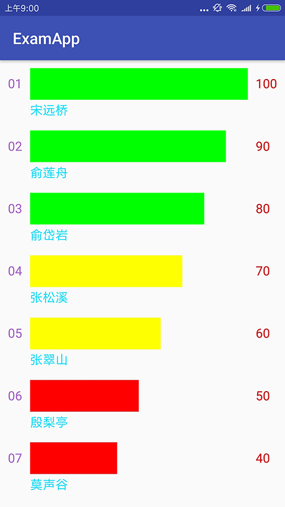

# RankView
这是一个可以直观显示排名情况的控件，根据水平矩形标识条的直观对比，以及简单的文本描述，我们就可以清晰的了解当前的排名情况。

# 控件效果

# 控件特性
+ 矩形标识条的宽度是根据每个条目的数值，按比例映射得到的像素值，因此可以直观地进行对比；
+ 数据集合的实体类通过注解与控件类相关联，从而使实体类更加灵活；
+ 支持许多自定义属性，如每个Item的矩形标识条的高度、左、右、底部文本的尺寸和颜色等等；
+ 当Item数量很多或高度较大导致整个控件高度超过一屏幕时，支持动态拉伸；

# 自定义属性

  | 序号 | 属性名   |  含义  | 默认值 |
  | ----| -----:  | ----:  | :----:  |
  | 1   |itemRectHeight     |每个Item的矩形标识条的高度             | 30dp |
  | 2   |itemVeticalSpace   |每个Item之间的垂直间距                | 20dp |
  | 3   |itemHorizontalSpace|Item矩形标识条与左右两边的文本的水平间距 | 10dp |
  | 4   |itemLeftTextSize   |左边文本的大小                       | 16sp |
  | 5   |itemRightTextSize  |右边文本的大小                       | 16sp |
  | 6   |itemBottomTextSize |底部文本的大小                       | 16sp |
  | 7   |itemLeftTextColor  |左边文本的颜色                       | BLACK |
  | 8   |itemRightTextColor |右边文本的颜色                       | BLACK |
  | 9   |itemBottomTextColor|底部文本的颜色                       | BLACK |

# 控件使用示例
1. 引入依赖

    在项目工程的build.gradle添加如下代码：

        allprojects {
            repositories {
                ...  //other repository
                maven { url 'https://jitpack.io' }
            }
        }
    }

    在需要使用本控件的module的build.gradle添加如下代码：

        dependencies {
    	            implementation 'com.github.yuanchaowhut:rankView:v1.7'
    	}

2. 布局文件

       注意：在xml布局中可以不使用自定义属性，因为有默认值。

       <?xml version="1.0" encoding="utf-8"?>
       <ScrollView xmlns:android="http://schemas.android.com/apk/res/android"
       xmlns:app="http://schemas.android.com/apk/res-auto"
       android:layout_width="match_parent"
       android:layout_height="match_parent"
       android:orientation="vertical">

       <LinearLayout
           android:layout_width="match_parent"
           android:layout_height="match_parent"
           android:padding="10dp"
           android:orientation="vertical">

           <cn.com.egova.examapp.RankView
               android:id="@+id/rank_view"
               android:layout_width="match_parent"
               android:layout_height="match_parent"
               app:itemBottomTextColor="@android:color/holo_blue_bright"
               app:itemBottomTextSize="16sp"
               app:itemRectHeight="40dp"
               app:itemHorizontalSpace="10dp"
               app:itemLeftTextColor="@android:color/holo_purple"
               app:itemLeftTextSize="16sp"
               app:itemRightTextColor="@android:color/holo_red_dark"
               app:itemRightTextSize="16sp"
               app:itemVeticalSpace="20dp" />

           <TextView
               android:layout_width="match_parent"
               android:layout_height="wrap_content"
               android:gravity="center_horizontal"
               android:layout_marginBottom="20dp"
               android:text="Hello World!" />

       </LinearLayout>
   </ScrollView>

3. 实体类

       public class RankBO {
           @Order("排序")
           private String order;

           @Label("名称")
           private String name;

           @Value("数值项")
           private String value;

           @GradeColor("颜色")
           private int color;

           //other field
           .........
       }

 4. 模拟数据

        private List<Object> getMockData() {
               List<Object> list = new ArrayList<>();
               RankBO rankBO1 = new RankBO("01", "宋远桥", "100", Color.GREEN);
               RankBO rankBO2 = new RankBO("02", "俞莲舟", "90", Color.GREEN);
               RankBO rankBO3 = new RankBO("03", "俞岱岩", "80", Color.GREEN);
               RankBO rankBO4 = new RankBO("04", "张松溪", "70", Color.YELLOW);
               RankBO rankBO5 = new RankBO("05", "张翠山", "60", Color.YELLOW);
               RankBO rankBO6 = new RankBO("06", "殷梨亭", "50", Color.RED);
               RankBO rankBO7 = new RankBO("07", "莫声谷", "40", Color.RED);
               list.add(rankBO1);
               list.add(rankBO2);
               list.add(rankBO3);
               list.add(rankBO4);
               list.add(rankBO5);
               list.add(rankBO6);
               list.add(rankBO7);
               return list;
        }

5. MainActivity

        RankView rankView = findViewById(R.id.rank_view);
        List<Object> data = getMockData();
        rankView.setData(data);

# 缺陷及不足
+ Item底部的文本必须简明扼要，字数不可过多，因为本控件不支持文本换行；
+ 控件的setData()方法要求传递的参数为List\<Object\>,集合的泛型为Object，目的是兼容所有实体类，
  引发的问题是客户端获取数据集合后(假如为List\<Student\>)，必须将其转换为List\<Object\>。
